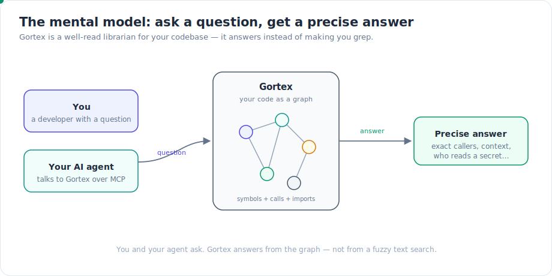
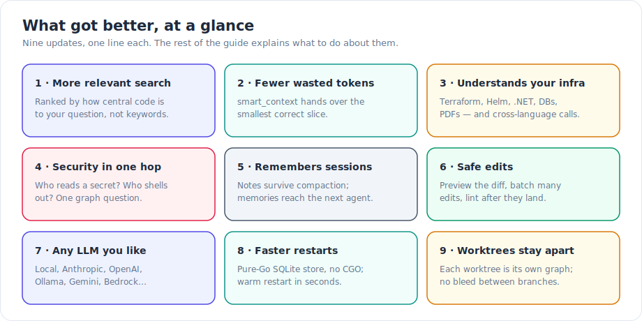
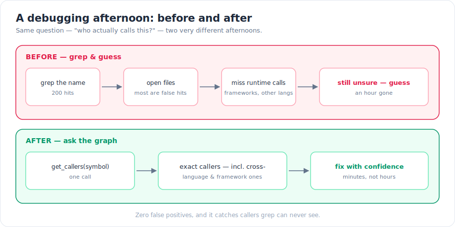
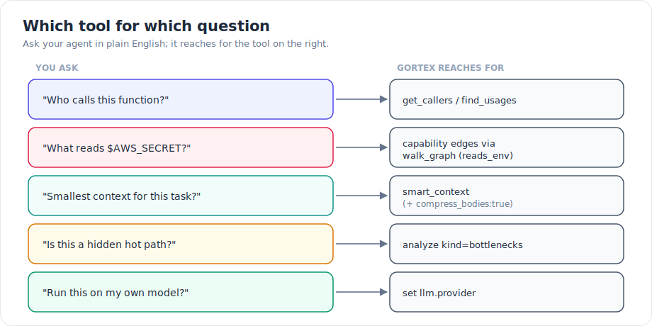

If you use Gortex — through an AI coding agent or from the command line — the last two months made your librarian noticeably sharper. You don't need to read the source, the internals, or any graph theory to benefit. This guide is the on-ramp: plain words, simple analogies, and the exact command or setting for each improvement. The deep dives are linked at the end of every section if you want the full story.

## The mental model

Gortex reads your repositories and turns them into a **knowledge graph** — a map where every function, type, and file is a dot (a "node"), and every relationship between them (this calls that, this imports that, this implements that) is a line (an "edge"). Then it hands that map to you and your AI agent over two doors: an **MCP server** (the protocol your agent speaks) and a CLI.

Think of it as a very well-read librarian for your codebase. Instead of grepping and guessing, your agent asks precise questions — "who calls this?", "what reads this secret?", "give me just enough context for this task" — and Gortex answers from the map.


*You and your agent ask questions; Gortex answers from the graph instead of from a fuzzy text search.*

Everything below is one of nine ways that librarian got better.


*Nine updates, one line each — the sections below tell you what to do about each.*

## 1. Search answers got more relevant

**What changed.** Ranking used to be hand-tuned. Now results are ordered by how *central* a piece of code is to the part of the graph your question is about — not just how many keywords match. The blend of "exact word match" versus "meaning" auto-tunes per query, vague questions get expanded by meaning, and a query that would return nothing gets rescued by being broken into parts. The team can also now *measure* ranking quality instead of guessing.

**What to do.** Mostly nothing — `search_symbols` and the `ask` agent are simply better now. For natural-language questions the default `assist:auto` expands them; `assist:on` forces expansion and reranking; `assist:off` is pure keyword search. If you run a team, you can measure your own retrieval quality:

```bash
gortex eval pack
```

[Read the deep dive →](/gortex/gortex-changes-may-2026/01-retrieval-got-smarter)

## 2. Your agent wastes fewer tokens

**What changed.** `smart_context` hands your agent the smallest *correct* set of code for a task. It now pulls in exactly what a change depends on, scales the budget to the size of your repo, and can render code at different densities. The big lever is `compress_bodies`: it replaces function bodies with their signature plus doc-comment — roughly 30–40% of the original tokens, across 14 languages. And `delta_from` re-sends only what changed since the last pack.

**What to do.** Open every task with `smart_context`. When you only need the *shape* of code, not the bodies, ask for compression:

```text
read_file(path, compress_bodies: true)
get_symbol_source(symbol, compress_bodies: true)
get_editing_context(path, compress_bodies: true)
```

On follow-up calls, pass `delta_from` to avoid re-sending what your agent already has.

[Read the deep dive →](/gortex/gortex-changes-may-2026/02-smart-context)

## 3. It understands more of your stack

**What changed.** Gortex now indexes far more than application code: Terraform, Helm, Ansible, .NET, COBOL/JCL, Quarto, Luau, C/C++ macros, MCP configs — plus images and PDFs as graph nodes, and even a live database schema. On top of that, a "synthesizer engine" recovers call edges that frameworks create at runtime and that cross language boundaries: React Native JS-to-native, Swift/Objective-C, Spring and Symfony dependency injection, MyBatis SQL, WebSocket/SSE. The upshot: `find_usages` and `get_callers` catch more *real* callers and report fewer false "this is unused" results.

**What to do.** Index your infra and docs too, not just app code. Declare specs and ADRs as `artifacts:` in `.gortex.yaml` so your agent can find them. Pull a live database schema into the graph:

```bash
gortex db schema --postgres <dsn>
```

For a language Gortex has no grammar for, add a regex fallback-chunker or an external extractor-plugin in `.gortex.yaml` — no fork required. (For cross-language call recovery specifically, see [the resolution deep dive](/gortex/gortex-changes-may-2026/03-cross-language-resolution); for the new file types, [the languages deep dive](/gortex/gortex-changes-may-2026/04-languages-and-file-types).)

## 4. It can answer security and performance questions

**What changed.** "Capability edges" turn three audit questions into one-hop graph lookups: *what reads this environment secret*, *what shells out to run a process*, and *what writes this field*. That's the backbone of a least-privilege or supply-chain check. A new bottleneck analyzer finds hidden slow paths where loops nest *across* function calls — a cubic hot path that no single function reveals on its own. And `analyze` is now a 60-kind dispatcher that also includes a 190-rule security scan, health grades, and change-impact scoring.

**What to do.** Hunt hot paths and audit capabilities directly:

```text
analyze(kind: "bottlenecks")
analyze(kind: "sast")
walk_graph(... reads_env / executes_process / accesses_field ...)
```

Traverse the capability edges (`reads_env`, `executes_process`, `accesses_field`) via `walk_graph`, `nav`, or `graph_query` to answer "what reads `$AWS_SECRET`" without reading a single file.

[Read the deep dive →](/gortex/gortex-changes-may-2026/05-deeper-analysis)

## 5. It remembers things across sessions

**What changed.** Two memory layers, for two different timescales. **Session notes** (`save_note`, `query_notes`, `distill_session`) survive a context compaction *within* one session — your agent's scratchpad doesn't get wiped when the conversation gets summarized. **Development memories** (`store_memory`, `query_memories`, `surface_memories`) are cross-session and team-wide. They're anchored to a symbol and surfaced *automatically* when that symbol comes back into the working set — so a hard-won "do not change this without X" lesson reaches the *next* agent, not just you.

**What to do.** Use `store_memory` for durable invariants, gotchas, and decisions. Call `surface_memories` at the start of a task to pick up what past agents learned. Use `save_note` as a per-session scratchpad for "remember this for the next half hour."

[Read the deep dive →](/gortex/gortex-changes-may-2026/06-agent-teammate)

## 6. It edits code safely

**What changed.** Edits made over MCP can now be previewed before they land — `dry_run` plus a unified-diff preview show you exactly what will change. Multiple heterogeneous edits compose in a single `batch_edit`. And after an edit, a syntax-health check plus an external-linter bridge (`lint_file`) catch a bad change immediately instead of three steps later. There's also a coordination registry so several agents can work together without stepping on each other.

**What to do.** Preview before you apply, and trust the post-edit check:

```text
edit_file(path, ..., dry_run: true)   # see the diff first
lint_file(path)                       # catch problems right away
```

[Read the deep dive →](/gortex/gortex-changes-may-2026/06-agent-teammate)

## 7. Run it on any LLM you already pay for

**What changed.** The `ask` agent and assisted search run on a provider *you* choose. Supported today: local llama.cpp, Anthropic, OpenAI, Ollama, Gemini, AWS Bedrock, DeepSeek — plus two CLI-subprocess providers that reuse your existing sign-in, the `claude` CLI and the `codex` CLI. Optional graph-aware routing sends simple tasks to a cheaper model and complex ones to a stronger model (off by default). If a provider can't start — missing API key, say — the `ask` tool just stays off and the direct graph tools keep working.

**What to do.** Set your provider and its key/model in `.gortex.yaml` (or via `GORTEX_LLM_PROVIDER`). The HTTP and subprocess providers need no special build:

```yaml
llm:
  provider: anthropic   # or openai, ollama, gemini, bedrock, deepseek, claudecli, codex, local
  routing:              # optional, off by default
    enabled: true
    simple_model: <cheaper-model>
    complex_model: <stronger-model>
```

[Read the deep dive →](/gortex/gortex-changes-may-2026/07-llm-providers-routing)

## 8. Faster, simpler install and restart

**What changed.** The graph store is now a pure-Go SQLite backend by default — no CGO needed for the store itself (the tree-sitter parsers still use CGO at build time), and it ships FTS5 full-text search. Restarts are warm: the daemon reconciles only what changed since last time (using saved file modification times) and comes back in seconds. All your per-user state now lives under one `~/.gortex` home, auto-migrated on first run. On the VS Code repo, search p95 dropped about 77%, `smart_context` p95 about 55%, and `get_file_summary` p95 about 94%.

**What to do.** Nothing required — SQLite is the default. If you want to choose explicitly:

```bash
gortex --backend memory   # or: --backend sqlite (default)
```

[Read the deep dive →](/gortex/gortex-changes-may-2026/08-storage-and-performance)

## 9. Multiple worktrees stay separate

**What changed.** Each git worktree is now its own repository instance, with its own graph. So callers, usages, and resolution don't bleed between your main checkout and a feature-branch worktree — a question about `main` answers from `main`, and a question about your feature worktree answers from *that* tree.

**What to do.** Track each worktree you care about. Gortex keeps them isolated across the CLI, the daemon, and MCP — no special flag needed.

[Read the deep dive →](/gortex/gortex-changes-may-2026/09-multi-workspace-worktrees)

## A debugging afternoon, before and after

The clearest way to feel the difference is the oldest question in the book — "who actually calls this?"


*Grep-and-guess scatters false hits and misses runtime calls; asking the graph returns the exact callers, including cross-language and framework ones.*

## Try this today

A short map from a plain question to the exact tool or command:


*Ask in plain English; your agent reaches for the tool on the right.*

- **"Who calls this?"** → `get_callers` / `find_usages`
- **"What reads `$AWS_SECRET`?"** → capability edges (`reads_env`) via `walk_graph`
- **"Smallest context for this task?"** → `smart_context` (add `compress_bodies: true`)
- **"Is this a hidden hot path?"** → `analyze kind=bottlenecks`
- **"Run this on my own model?"** → set `llm.provider`
- **"What did past agents learn here?"** → `surface_memories`
- **"Show me the diff before it lands?"** → `edit_file` with `dry_run: true`

**Where to go deeper:** each section above links to its full deep dive — start with [Retrieval got a lot smarter](/gortex/gortex-changes-may-2026/01-retrieval-got-smarter) and follow the series from there.

---

*Part of the [Gortex May–June 2026 release series](/gortex/gortex-changes-may-2026).*

[↑ Series overview](/gortex/gortex-changes-may-2026) · [Retrieval got a lot smarter →](/gortex/gortex-changes-may-2026/01-retrieval-got-smarter)
