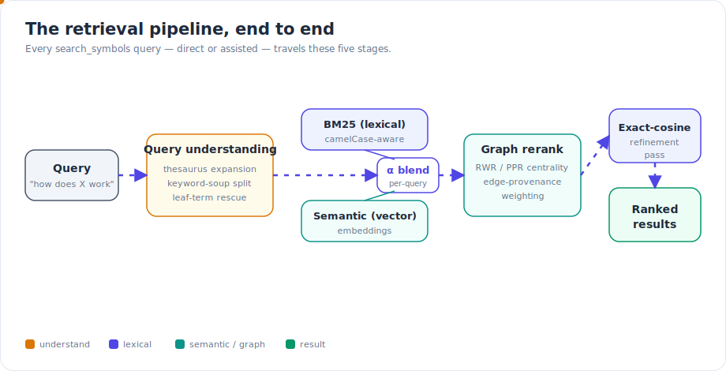
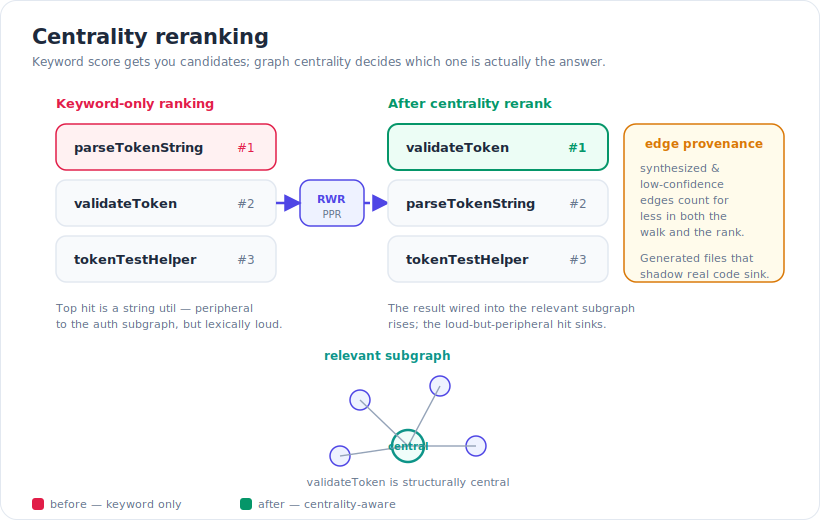
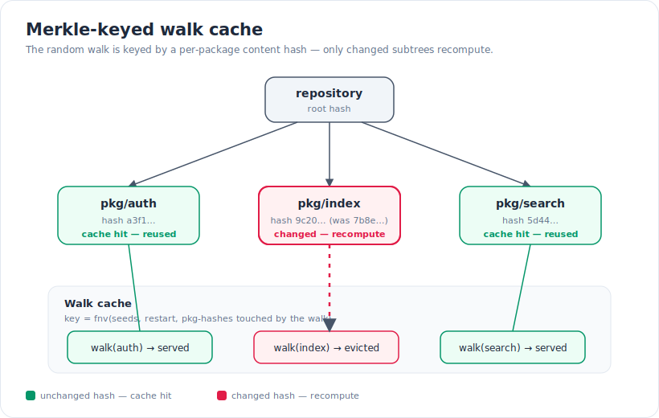
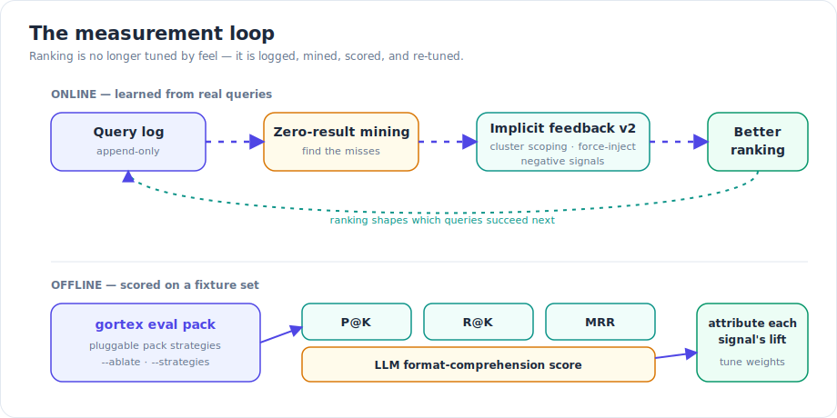

For most of Gortex's life, search ranking was tuned by feel. You'd run a query, eyeball the top ten, nudge a weight, and run it again. That works until it doesn't — until "how does indexing work" returns the function literally named `indexing` instead of the indexer's entry point, and you have no principled way to say whether your last change made things better or just different. The May–June 2026 cycle made retrieval the headline investment, and the through-line is a shift from *tuned-by-feel* to *measured-and-ranked*: better query understanding, graph-centrality reranking, and — the part that ties it together — a real evaluation harness so every change is scored, not guessed.

## What shipped

### A pipeline, not a single ranker

A query no longer means "BM25, then sort." It flows through five distinct stages, and the same path powers both direct `search_symbols` and the assisted modes (`assist: auto/on/off/deep`).

*A query travels query understanding, a per-query alpha blend of BM25 and semantic, a graph-centrality rerank, and an exact-cosine refinement pass before results come out.*

#### Query understanding

Before anything is scored, the query is *understood*. Three mechanisms do most of the work:

- **Equivalence expansion.** A concept-relatedness thesaurus layer expands the query by meaning, so vocabulary in your question bridges to the words a symbol actually uses (`auth` ↔ `login`, `delete` ↔ `remove`). This runs deterministically — no LLM required.
- **Keyword-soup detection.** An operator-free pile of terms (a degenerate boolean OR-list) is detected and split into per-term lexical fetches instead of being thrown at the ranker as one blob.
- **Leaf-term rescue.** A zero-result identifier query is decomposed into its leaf terms rather than returning nothing — so `parseAuthTokenHeader` that doesn't exist verbatim still surfaces the pieces that do.

#### Per-query blend

The BM25-versus-semantic mix is not a fixed constant. It's a continuously tuned per-query **alpha**: identifier-shaped queries lean lexical (BM25 finds exact names best), natural-language questions lean semantic. A bare `CamelCase` token lands at the identifier end and a prose phrase at the language end, with everything in between getting a proportional blend rather than a single fixed weight.

#### Graph-centrality rerank

This is the structural step. Candidates are reranked by **centrality** in the relevant subgraph using Random-Walk-with-Restart / Personalized PageRank. The intuition: a result that many relevant things point at — that sits at the heart of the subgraph your query is about — should rank above a result that merely happens to contain your keywords.

*Keyword score gets you candidates; a random-walk-with-restart pass promotes the candidate that is structurally central to the relevant subgraph.*

#### Exact-cosine refinement

Embedding retrieval is approximate by design. A post-rerank refinement stage runs an **exact-cosine recovery pass** over the surviving candidates, so the precision you lose to approximate nearest-neighbour search at recall time is bought back at the top of the list, where it matters.

## How it works: the Merkle-keyed walk cache

A random walk over a subgraph is not free, and a code graph changes constantly. Recomputing centrality from scratch on every keystroke would be untenable; never recomputing it would serve stale rankings. The cycle's answer is a walk cache keyed by content.

The walk's cache key is built from the resolved seeds, the restart probability, and a per-package content hash for every package the walk touches. Change a package's contents and its hash changes; any cached walk whose key folded in that hash no longer matches and is recomputed. Every other package's walk — unchanged hash, unchanged key — is served straight from cache.

*The walk is keyed by per-package content hashes, so editing one package invalidates only the walks that touch it; the rest are reused.*

This is the Merkle idea applied to retrieval: a hash that rolls up a subtree's contents lets you compare two states cheaply and recompute only the parts that diverged. In practice it means the expensive structural signal stays fresh on a live, edited repository without paying full price on every query.

### Not all edges are equal

Centrality is only as honest as the graph it walks. Two adjustments keep it from being gamed by the graph's own noise:

- **Edge provenance is attenuated.** Synthesized and low-confidence edges count for less in both the walk and the final rank — a guessed cross-language call shouldn't lend a symbol the same authority as a directly resolved one.
- **Generated files are down-ranked.** A generated file that shadows a real implementation is pushed down, so the hand-written source wins over its machine-emitted double.

## Beyond ranking: the other channels

### Documentation as a first-class retrieval channel

"How does X work" is usually answered by prose, not by the symbol that implements X. Documentation now has its own retrieval channel with prose-tuned reranking, so an explanatory doc section can surface ahead of the implementing function when the question is conceptual. You opt into it per query with the `corpus` parameter (`code`, `docs`, or `all`).

### Embeddings and sub-chunking

Three embedding changes landed:

- **Launch-time variant selection** picks the embedding-model variant at startup.
- **AST-aware sub-chunking** for Ruby, PHP, Kotlin, and Swift splits large symbols along syntactic boundaries instead of arbitrary byte windows, so a chunk is a coherent unit of code.
- The **exact-cosine recovery pass** described above closes the precision gap at the top.

### Tokenization that understands identifiers

Code identifiers are compound words — `parseHTTPResponse`, `user_id_cache`. Two tokenization changes help the lexical side see the pieces:

- A **learned sub-word boundary table**, built at index time, so the tokenizer knows where compound identifiers actually break in *this* corpus.
- Optional **sparse sub-word n-gram tokenization**, which helps camelCase / snake_case / compound identifiers match even when the query spells the boundaries differently.

## How it works: measurement is now real

The most consequential change isn't any single ranking signal — it's that we can now *tell* whether a change helped.

*An append-only query log feeds zero-result mining and implicit-feedback learning; offline, `gortex eval pack` scores retrieval with P@K, R@K, MRR and a comprehension score, with an ablate mode to attribute each signal.*

Two loops run side by side. **Online**, an append-only query log feeds zero-result mining (find the queries that returned nothing and fix them) and implicit-feedback learning, now in its second iteration: cluster scoping, force-injection of known-relevant results, and negative signals that demote results an agent skipped over. **Offline**, a pack-strategy evaluation harness scores retrieval on a fixture set with Precision@K, Recall@K, MRR, and an LLM format-comprehension score — run via `gortex eval pack`. Pack strategies are pluggable, and an `--ablate` mode lets you turn signals off one at a time to see what each is actually worth. That's the difference between "this feels better" and "this moved MRR by a measurable amount."

These mechanics also showed up as production latency wins. On the VS Code repository, with the FTS5 sidecar, search p95 dropped roughly **77%**, `smart_context` p95 roughly **55%**, and `get_file_summary` p95 roughly **94%**.

## Try it

Everything here is reachable from the tools you already use.

- **Plain search** — `search_symbols` runs the full pipeline. The blend, expansion, and centrality rerank are on by default.
- **Pick a corpus** — pass `corpus: "docs"` or `corpus: "all"` to `search_symbols` to bring the documentation channel into play for conceptual questions.
- **Steer expansion** — the `expand` parameter selects expansion channels (`both`, `equivalence`, `llm`, `off`); `equivalence` runs the curated synonym table even with no LLM provider configured.
- **Assisted modes** — `assist: auto` (the default) engages on natural-language queries and skips identifier lookups; `on` forces expansion and rerank; `off` is pure BM25; `deep` adds a body-grounded verification pass.
- **Inspect a ranking** — pass `debug: true` to `search_symbols` to get per-candidate scores and per-signal contributions, so you can see *why* a result placed where it did.
- **Score it yourself** — run `gortex eval pack` against a fixture set to get P@K / R@K / MRR; add `--ablate` to attribute the lift, and `--strategies` to compare context-packing strategies.

## Why it matters

If you're driving a coding agent, retrieval quality is the ceiling on everything downstream: the agent can only reason about what it was handed. Ranking by keyword loudness hands it the wrong files; ranking by graph centrality hands it the ones that actually sit at the center of the thing you asked about. And because the whole pipeline is now scored — not tuned by feel — the quality only ratchets in one direction.

---

*Part of the [Gortex May–June 2026 release series](/gortex/gortex-changes-may-2026).*

[↑ Series overview](/gortex/gortex-changes-may-2026) · [smart_context: less, but more relevant →](/gortex/gortex-changes-may-2026/02-smart-context)
