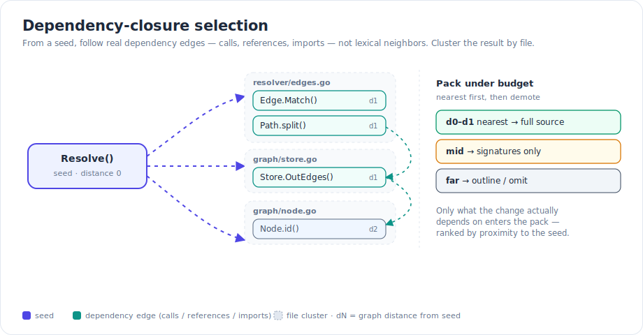
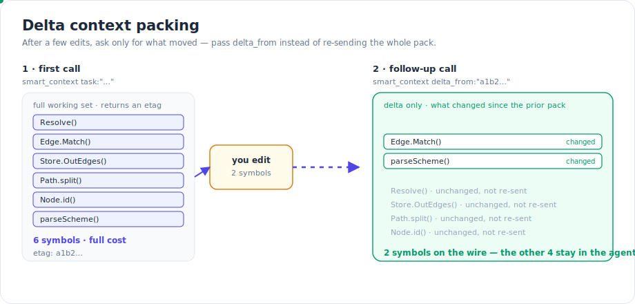

Every coding agent has the same failure mode under pressure: it either reads too little and hallucinates the parts it didn't see, or it reads too much and drowns the signal in boilerplate it will never use. The cost of getting this wrong is paid twice — once in tokens, once in the quality of the answer. `smart_context` exists to assemble the *smallest correct working set* for a task in a single call, and the work in this release is about spending tokens only where they change the outcome.

The principle underneath all of it: relevance is a graph property, not a text-matching one. The symbols a change depends on are reachable from it along call, reference, and import edges — so that is what gets packed, ranked by how close each one sits to the thing you're actually touching.

## What shipped

### Dependency-closure selection

The core of a good context pack is choosing the *right* symbols, not the textually nearest ones. A grep-style approach pulls in whatever shares a name or a substring; a graph approach pulls in whatever a change actually depends on.

`smart_context` seeds from your task, and a context-closure pass walks the transitive dependency graph — calls, references, imports, `depends_on` — to gather exactly the symbols the seed reaches. Each reached symbol is ranked by its graph distance to the nearest seed, then the working set is clustered by file before packing. Clustering by file matters because an agent reasons about a file as a unit: three related functions from `resolver/edges.go` shown together are worth more than three isolated fragments scattered across the pack.

*From a seed symbol, the closure follows real dependency edges — not lexical neighbors — and groups the result by file, nearest first.*

The same machinery is available directly as the `context_closure` tool when you already have a set of starting points (seed files or symbol IDs) and want everything they transitively depend on, ordered by proximity.

### A budget that scales with the project

A fixed seed count and a fixed token budget are wrong in both directions: too generous on a small library, too stingy on a large monorepo. In this release both scale to graph size. The seed count steps up with the node count of the indexed graph — a few seeds keep the pack lean on a small repo, a wider net is worth it once the graph is large enough that the right symbol is unlikely to be in the first handful — and the default token budget for the graded manifest scales on the same buckets, so the two move together.

This is deliberately coarse — a handful of size buckets, not a tuned curve — because the goal is a sensible default, not a knob you have to think about. You can always override the budget per call.

### Ranked through the full rerank pipeline

When the budget is tight, *which* symbols you keep is the whole game. The working set is ranked through the same rerank pipeline that powers search — the same centrality and blend machinery — so the symbols most relevant to the task survive the cut and the marginal ones are demoted or dropped. You are not keeping the first N symbols the closure happened to visit; you are keeping the N most relevant ones.

### Fidelity tiers: full, compress, omit

Choosing the right symbols is half the problem. The other half is choosing how densely to render each one. A pack where every symbol is shown at full fidelity wastes its budget on bodies the agent will skim; a pack that shows everything as a bare signature throws away the detail the agent needs at the center of the change.

So fidelity is per-symbol, and it's controllable per-glob: full / compress / omit lets you decide how densely each part of the repo is represented. Generated code and vendored trees can be compressed or omitted; the package you're working in stays full. On top of that, large interchangeable symbol families are *skeletonized* in graded context — one representative is kept in full and the rest are reduced to signatures. If a package has twenty near-identical `resolveX` functions, the agent learns the shape from one and gets a signature index of the other nineteen, instead of paying twenty times for the same pattern.

*The same symbols rendered four ways. Relevance decides which tier each symbol lands in; the budget decides where the cutoff falls.*

### compress_bodies

The workhorse of the compress tier is `compress_bodies`. It elides function bodies down to stubs while keeping signatures, doc-comments, and the surrounding structure intact — roughly 30–40% of the original tokens, across 14 languages. The agent still sees what each symbol *is* and what it's *for*; it just stops paying for the implementation details it isn't going to read.

It's available on `read_file`, `get_symbol_source`, and `get_editing_context`, so you can reach for it on any read, not only inside a context pack. And because agents reliably forget it exists, a hook nudges agents that do full-body Gortex reads toward `compress_bodies` when the task doesn't need the bodies.

### Delta context packing

Context isn't a one-shot. An agent calls `smart_context`, makes a few edits, and then needs the working set again — and re-sending the whole pack means re-paying for symbols that haven't moved. Delta packing closes that gap. Pass `delta_from` (with the etag from a previous pack) and you get back only what changed since that pack, instead of the whole working set.

*The follow-up call sends only the symbols that moved. The unchanged ones already live in the agent's context — no reason to send them twice.*

## How it works: proximity, then demotion

It's worth being precise about the order of operations, because it's what makes the pack both correct and small.

First, **selection by reachability.** The closure expands from the seeds along dependency edges and assigns every reached symbol a distance — distance 0 for the seeds, distance 1 for their direct dependencies, and so on, up to a depth and node cap. A symbol that no edge reaches is simply not a dependency of your change, and never enters the candidate set.

Second, **ranking.** Candidates are scored through the rerank pipeline so the ordering reflects genuine relevance — graph proximity blended with centrality — not just raw hop count.

Third, **demotion under budget.** The pack fills nearest-first at full fidelity. As the budget tightens, symbols are demoted rather than cut outright: full source for the closest, signatures for the middle band, outline-only or omitted for the far edge. The center of the change ends up rendered in full and the periphery present as structure — enough for the agent to know it exists and what shape it has, without paying for its body.

The payoff of this ordering is that the budget is spent on the symbols that earned it. Two packs of the same token size are not equal: one filled the budget with whatever it found first, the other with the symbols closest to the work.

## Try it

The packing tools are MCP tools exposed by the Gortex daemon:

- **`smart_context task:"…"`** — assemble the working set for a task in one call. Add `fidelity:"graded"` for the focus / adjacency-stub / outline manifest, and `token_budget:` to set the ceiling explicitly (it otherwise scales to repo size).
- **`smart_context … delta_from:"<etag>"`** — return only what changed since a prior pack. The etag rides on the previous response; `if_none_match` with the same etag turns an unchanged repo into a near-zero-token no-op.
- **`smart_context … estimate:true`** — a dry run that returns only a projected token cost for the task at the chosen fidelity, so you can budget before you fetch.
- **`context_closure symbols:"pkg/foo.go::Bar" token_budget:…`** — pack the dependency closure of a set of seeds directly, ordered by proximity.
- **`compress_bodies:true`** on `read_file` / `get_symbol_source` / `get_editing_context` — signatures, doc-comments, and structure; bodies become stubs.

For the per-glob full / compress / omit fidelity controls, pass `fidelity_globs:` alongside `compress_bodies` on `read_file` / `get_editing_context` — an ordered, comma-separated list of `glob:fidelity` rules (e.g. `internal/**:full,*_test.go:omit,vendor/**:compress`), where the first matching glob wins. Full for the code you work in, compress or omit for generated and vendored trees. And pass `format:"gcx"` to any list-shaped response for a round-trippable compact wire format that shaves another slice off the token bill.

## Why it matters

The token budget is not the real constraint — attention is. An agent that reads less but reads the *right* less reasons better, not just cheaper. Dependency-closure selection makes the working set the symbols your change actually touches; the rerank pipeline keeps the most relevant ones under a tight budget; fidelity tiers and `compress_bodies` render each at the density it deserves; and delta packing means you never pay twice for a symbol that didn't move. The net effect is the one that counts: fewer tokens per task, with the agent seeing more of what matters and less of what doesn't.

---

*Part of the [Gortex May–June 2026 release series](/gortex/gortex-changes-may-2026).*

[← Retrieval got a lot smarter](/gortex/gortex-changes-may-2026/01-retrieval-got-smarter) · [↑ Series overview](/gortex/gortex-changes-may-2026) · [Cross-language resolution & framework awareness →](/gortex/gortex-changes-may-2026/03-cross-language-resolution)
