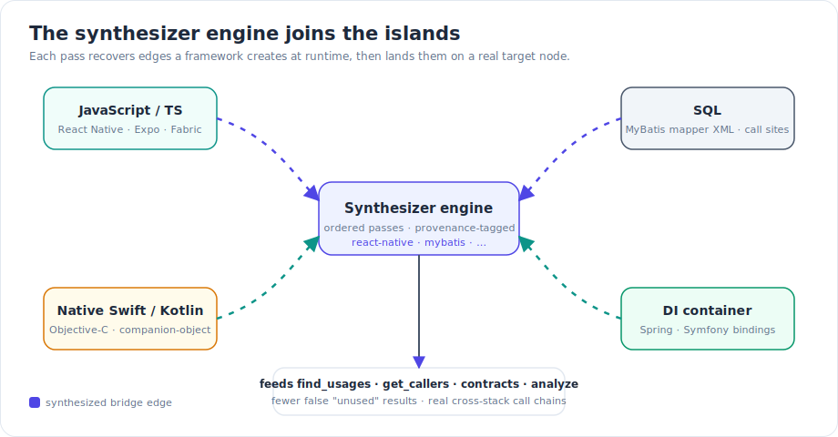
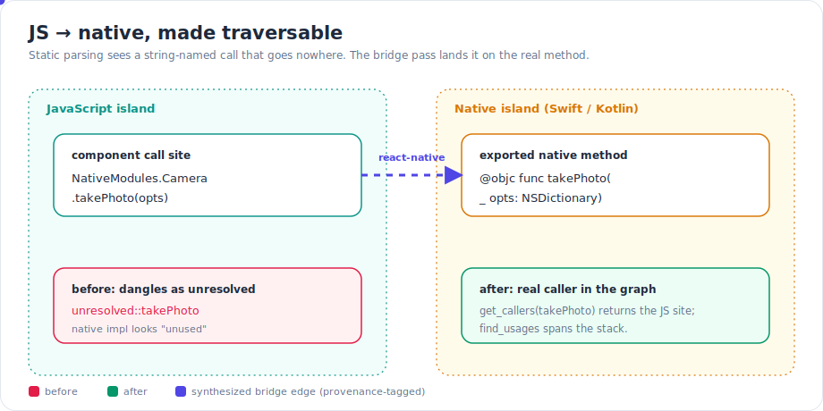
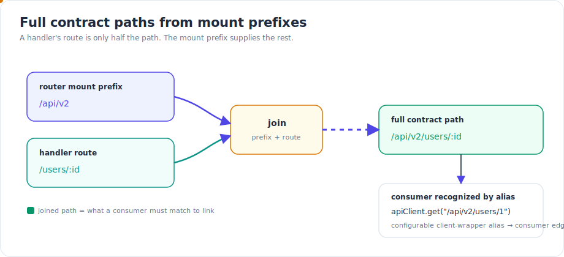
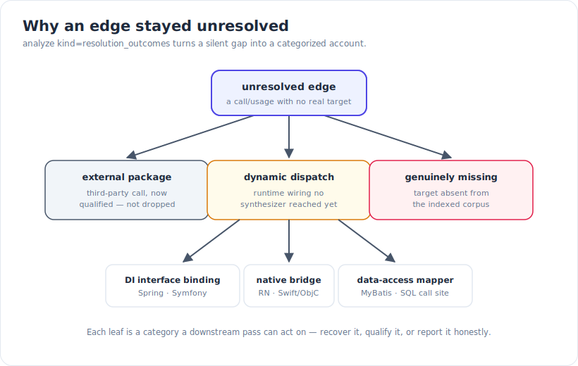

A code-intelligence graph is only as good as its edges. Static parsing recovers the calls a language's own syntax makes obvious — `foo()` calling `foo`. But modern software spends a lot of its life crossing boundaries that the syntax does not spell out: a JavaScript component invoking a native method by name, a call through an interface that a dependency-injection container resolves to a concrete bean at startup, a DAO method whose SQL lives in a separate XML file. To static analysis those calls dangle. The target looks unused; the call chain stops at the boundary. This release closes a large cluster of exactly those gaps.

## What shipped

The spine of this work is a **framework dynamic-dispatch synthesizer engine**: a set of ordered passes that run after the normal resolver settles, each recovering a specific family of edges that a framework creates at runtime, then landing those edges on a real target node in the graph. Each pass carries a stable provenance tag, so every synthesized edge records which mechanism produced it.



*The synthesizer engine joins the islands: each pass recovers edges a framework creates at runtime, then lands them on a real target.*

### Cross-language bridges

The most visible payoff is bridges between language islands that previously never touched in the graph:

- **React Native** — a JavaScript call into a native module is linked to its native implementation.
- **Swift ↔ Objective-C** — calls that cross the Swift/Objective-C boundary are resolved.
- **Expo Modules** — module methods invoked from JavaScript are linked to their native definitions.
- **Fabric / Codegen view components** — a JavaScript view component is linked to its native implementation.

The mechanism is the same in each case: the framework's convention (a registered module name, an `@objc` export, a codegen contract) tells you which native symbol a string-named JS call resolves to. The synthesizer encodes that convention and lands a real edge.



*JS → native, made traversable: static parsing sees a string-named call that goes nowhere; the bridge pass lands it on the real method.*

### Dependency-injection containers

A call through an interface is a dead end unless you know which implementation the container wired behind it. Spring and Symfony **interface-to-implementation bindings** are now resolved, so a call made against an interface lands on the concrete bean or service that the container injects. That single edge is what turns "this interface method has no callers" into the real production call site.

### Data access

Persistence frameworks split a query across files, which breaks naive parsing. **MyBatis mapper XML** is now indexed, and DAO methods are linked to the SQL they execute. More generally, **cross-language SQL call sites** are linked to the SQL functions they invoke — so a call that hands off into the database layer is no longer a silent boundary.

### Transport edges

Streaming and routing now produce real edges too. **WebSocket upgrade** and **Server-Sent-Events (SSE)** stream edges are extracted, so a long-lived connection is a traversable relationship rather than an opaque handler. On the HTTP side, contracts got two upgrades: router **mount prefixes are joined into full contract paths**, and configurable **client-wrapper aliases** are understood as consumers — so a request made through a project's own thin HTTP wrapper still links to the contract it calls.



*Full contract paths from mount prefixes: a handler's route is only half the path — the mount prefix supplies the rest.*

### Language depth

Several languages gained resolution that static parsing alone routinely misses:

- **Rust** — impl-block, self-receiver, and module-path resolution, so method calls land on the right `impl` and `self.foo()` resolves through the receiver's type.
- **Kotlin** — companion-object dispatch and lambda-parameter binding.
- **C#** — interface vs base class is discriminated for external bases, so an external supertype is not miscategorized.
- **Svelte** — default re-exports resolve, and `package.json` `exports` subpaths resolve to the file they map to.

And a broad default flipped on: **external-package call qualification is now default-on**. Calls into third-party packages are qualified rather than dropped, so a call that leaves your code for a dependency stays in the graph as a known external target instead of vanishing.

## How it works: synthesize, then explain the rest

The engine runs as an ordered sequence of passes in a single settle window, after the base resolver has produced its `implements` and `extends` edges and before cross-repo linking, so a synthesized cross-repo call still gets its parallel cross-repo edge. Each pass is a small unit with a name and a `Synthesize` step that scans the graph and returns the count of edges it landed on a real target. Adding a new framework is one line in the engine's pass list, not an edit scattered across the resolver — which is why the bridge set could grow this much in one cycle.

No synthesizer recovers everything, and pretending otherwise is how silent gaps creep in. So the second half of this work is a structured **outcome taxonomy**: every edge that stays unresolved is classified by *why*. Was the target an external package? A dynamic dispatch no pass reached? A genuinely missing symbol? `analyze kind=resolution_outcomes` returns that categorized account instead of leaving a blank.



*Why an edge stayed unresolved: `analyze kind=resolution_outcomes` turns a silent gap into a categorized account.*

There is one more piece of precision worth calling out. Every usage edge now carries a **per-reference context label** — for example, whether the reference is in test code or production code. `find_usages` gained a context filter on top of that, so you can ask "where is this used in a test" versus "where is this used in production" and get two different, correct answers from the same symbol.

## Try it

The synthesizer engine and the new resolution run automatically during indexing — there is nothing to enable for the bridges, the DI bindings, the MyBatis linking, or the transport edges. To inspect the results:

```bash
# Why didn't a given edge resolve? Get the categorized account.
gortex analyze --kind resolution_outcomes
```

From the MCP surface, the same capabilities are tool calls:

- `find_usages` — now spans language boundaries; pass the context filter to split test usage from production usage.
- `get_callers` / `get_call_chain` — return cross-stack callers and chains that cross the bridges.
- `contracts` — reflects full mount-prefix-joined paths and recognizes wrapper-aliased consumers.
- `analyze kind=resolution_outcomes` — the why-unresolved taxonomy.
- `analyze kind=dead_code` — fewer false positives, because the recovered edges give previously "unused" symbols their real callers.

Re-index a repository (`reindex_repository`, or let the daemon pick up changes on its next pass) to populate the synthesized edges, then query as usual — the edges are already in the graph the tools read.

## Why this matters

These synthesized edges are not a side report — they flow into the tools you already use. `find_usages`, `get_callers`, `contracts`, and the analysis tools all read the enriched graph, so two concrete consequences follow:

- **Fewer false "unused" results.** A native method called only from JavaScript, an interface implementation reached only through a DI container, a SQL function invoked only from a mapper — these used to show up as dead code. Now they have real callers, so `analyze kind=dead_code` stops flagging them.
- **Real cross-stack call chains.** `get_callers` on a native method returns the JavaScript site that calls it; a chain can run from a JS component, across the bridge, into native code — or from an HTTP consumer, through the joined contract path, to its handler. It no longer stops at the language boundary.

For anyone running a coding agent over a polyglot codebase, that is the difference between an agent that says "this looks unused, safe to delete" and one that sees the call that actually keeps it alive.

---

*Part of the [Gortex May–June 2026 release series](/gortex/gortex-changes-may-2026).*

[← smart_context: less, but more relevant](/gortex/gortex-changes-may-2026/02-smart-context) · [↑ Series overview](/gortex/gortex-changes-may-2026) · [Many more languages — and file types →](/gortex/gortex-changes-may-2026/04-languages-and-file-types)
