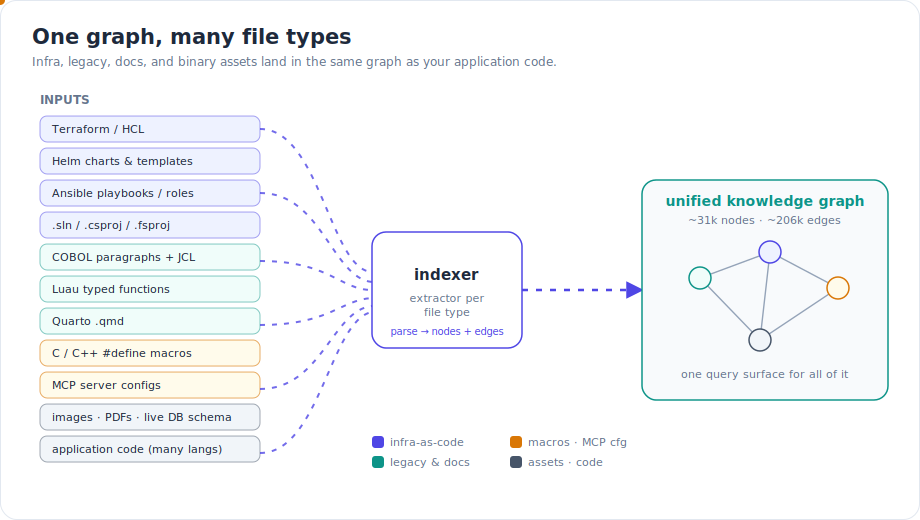
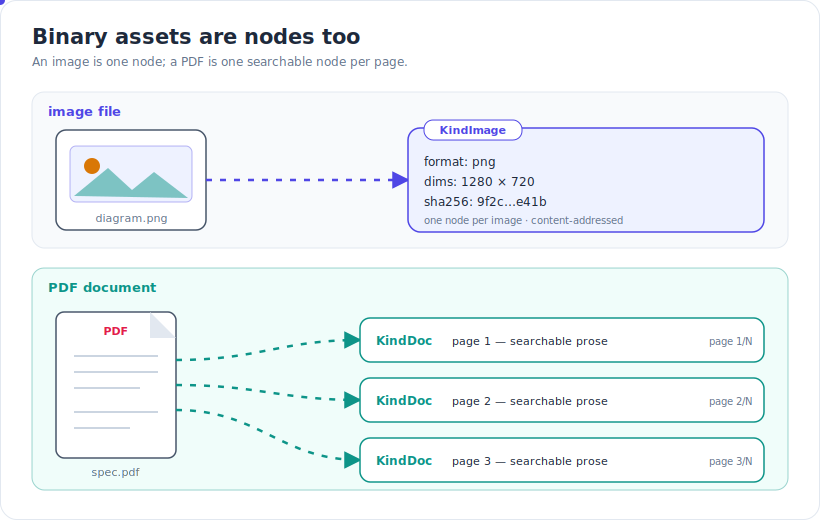
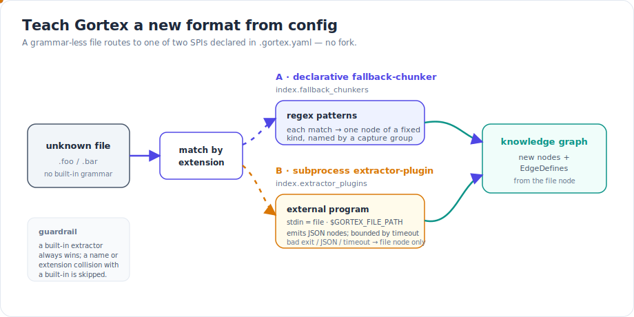

Most code-intelligence tools draw a hard line around "real" source files and ignore everything else: the Terraform that provisions your cluster, the Helm chart that ships the service, the COBOL still running payroll, the PDF spec the API was supposed to implement, the diagram explaining the whole thing. But a system is more than its application code, and an agent reasoning about that system needs the rest of it too. This release widens what Gortex ingests — infrastructure-as-code, legacy systems, documentation, binary assets, and even a live database — so all of it lands in the same queryable graph, with the same edges and the same tools.



*Every file type gets its own extractor, but they all converge on one graph with one query surface.*

## What shipped

### Infrastructure as code

Three of the most common ways teams describe infrastructure are now first-class.

**Terraform / HCL.** Blocks are addressable nodes, and Gortex resolves cross-block references into `REFERENCES` edges — so when a `resource` interpolates an output or a `var`, that dependency is a real edge you can traverse, not a string match.

**Helm.** Rather than treating templates as opaque text, Gortex builds a semantic layer: named templates (`define`), the `include` / `template` calls that invoke them, and the chart dependencies declared in `Chart.yaml`. You can ask which templates a given partial feeds into, or what a chart pulls in.

**Ansible.** Playbooks, roles, tasks, and handlers are indexed as nodes, and module calls become edges — so a task that invokes a module, or notifies a handler, is connected in the graph instead of inferred by eye.

### The .NET project graph

.NET solutions are ingested at both levels. A `.sln` produces a project graph across its member projects, and each `.csproj` / `.fsproj` / `.vbproj` contributes its `ProjectReference` and `PackageReference` dependencies plus its `TargetFramework`. The result is a dependency view of a .NET solution that you can query the same way you query a Go or TypeScript module graph.

### Legacy systems

Two extractors reach back to systems that long predate most code-intelligence tooling.

**COBOL** programs are decomposed into paragraphs, and `PERFORM` statements are wired into a call graph — so a sixty-year-old language gets the same caller/callee navigation as anything modern. A companion **JCL** extractor reads the surrounding job streams.

**Luau** support covers typed functions, type aliases, and exports — useful for Roblox and other Lua-derived codebases that the stock Lua tooling handles poorly.

### Documentation and config formats

**Quarto `.qmd`** documents are split into their structural parts: frontmatter keys, prose sections, and the executable code chunks embedded between them. **MCP server configurations** are ingested as graph nodes too — servers, the packages they run, and `requires-env` edges for the environment they depend on — so the tooling an agent uses is itself describable in the graph.

### C/C++ preprocessor macros

Macros are notoriously invisible to tools that only see post-preprocessor or post-AST code. Gortex indexes `#define` macros as `KindMacro` nodes and, crucially, performs **hidden-call recovery**: when a call is made *through* a macro, that call edge is recovered rather than lost. A function reached only via a macro expansion is no longer a phantom.

## Multimodal: images and PDFs as graph nodes

Your diagrams and specs are part of the codebase, so they're now part of the graph.



*An image collapses to a single content-addressed node; a PDF fans out into one searchable document node per page.*

An image file becomes a single `KindImage` node carrying its `format`, `dimensions`, and a `sha256` of its contents — content-addressed, so identical assets are identifiable and you can reason about them without opening a binary blob. A PDF is handled differently: it becomes one searchable `KindDoc` node **per page**, so the prose on each page is queryable alongside source code. A specification PDF and the package that implements it can now sit in the same graph and, where the link is declared, be connected by an edge.

## Live database schema ingestion

Code describes intent; a running database describes reality. Gortex can connect to a live database and ingest its schema directly:

```bash
gortex db schema --postgres <dsn>
```

This reads the database's tables, columns, primary keys, and foreign keys — and turns the tables and columns into graph nodes. The schema your code *actually* talks to becomes queryable next to the code, which is exactly where you want it when you're checking whether a struct still matches a column, or which code touches a table you're about to migrate.

## How it works: extensibility without a fork

The list above will never be complete — every team has a bespoke format, a homegrown DSL, a config language no parser ships for. So instead of asking you to fork Gortex and write a tree-sitter grammar, this release adds two extension points (SPIs) you configure entirely from `.gortex.yaml`. A file with no built-in grammar is routed by its extension to whichever path you've declared.



*Two config-declared paths to indexing a format Gortex doesn't ship a grammar for — and a built-in always wins on collision.*

**The declarative fallback-chunker** (`index.fallback_chunkers`) is the lightweight path: you register a language and the extensions it claims, then supply a list of regex patterns. Each pattern carries a `kind` (the graph node kind it emits) and a `name_group` (the capture group whose text names the node) — so every match yields one node of that kind, named from the capture, plus an `EdgeDefines` edge from the file node. It's enough to turn a flat config or a simple DSL into addressable, searchable symbols without writing any code.

**The subprocess extractor-plugin** (`index.extractor_plugins`) is the powerful path: you point Gortex at an external program. Gortex writes the file's contents to the program's stdin, names the file in the `GORTEX_FILE_PATH` environment variable, and reads back JSON describing the nodes to emit. The whole thing is bounded by a timeout, and it fails *safe* — a non-zero exit, malformed JSON, or a timeout degrades gracefully to just the file node, so a misbehaving plugin can never fail the index.

Both paths share one guardrail: a built-in extractor always wins. If a fallback chunker or plugin claims a language name or file extension that a built-in already handles, the custom registration is skipped — you can't accidentally shadow the parsers Gortex ships.

## Try it

Indexing is automatic — any of the new file types in a tracked repo are picked up the moment they're indexed. Then query them like anything else:

- `search_symbols` finds the new symbols — a Helm template, a Terraform block, a COBOL paragraph, a `.csproj` package reference — by name or concept.
- `find_usages` / `get_callers` traverse the new edges: Terraform `REFERENCES`, Ansible module calls, the COBOL `PERFORM` call graph, and the C/C++ calls recovered through macros.
- `search_text` searches the per-page `KindDoc` prose extracted from your PDFs.
- `gortex db schema --postgres <dsn>` pulls a live schema's tables and columns into the graph.

To teach Gortex a format it doesn't ship, add a block to `.gortex.yaml`:

```yaml
index:
  fallback_chunkers:
    - language: mydsl
      extensions: [".mydsl"]
      patterns:
        - { regex: "^rule\\s+(\\w+)", kind: "rule", name_group: 1 }
  extractor_plugins:
    - language: widget
      extensions: [".wdgt"]
      command: ./tools/widget-extract
      timeout_ms: 2000
```

The fallback chunker needs no build step; the plugin only needs a program that reads stdin and prints the node JSON.

## Why it matters

A knowledge graph is only as useful as the territory it covers. When infrastructure, legacy code, documentation, binary assets, and a live database schema all live in the same graph as your application code — with the same edges and the same tools — questions that used to span four tools and a lot of guesswork become a single traversal. And because the two SPIs let you add formats from config, the breadth isn't frozen at whatever shipped: the graph grows to fit your stack, not the other way around.

---

*Part of the [Gortex May–June 2026 release series](/gortex/gortex-changes-may-2026).*

[← Cross-language resolution & framework awareness](/gortex/gortex-changes-may-2026/03-cross-language-resolution) · [↑ Series overview](/gortex/gortex-changes-may-2026) · [Deeper analysis →](/gortex/gortex-changes-may-2026/05-deeper-analysis)
