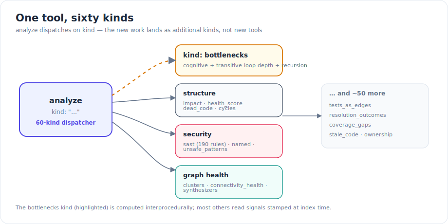
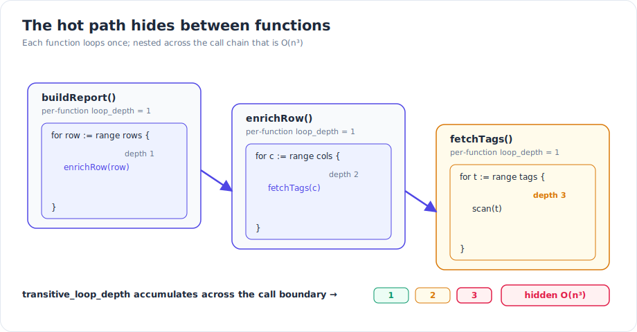
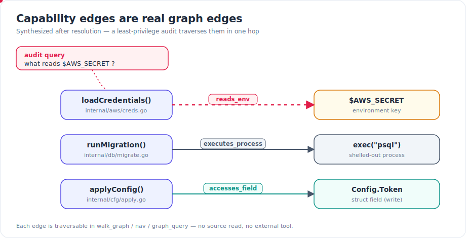

Some of the most useful questions about a codebase don't map to a single function. *Where could this secret leak? What is the real hot path? Is this Java symbol actually dead?* Answering them usually meant grepping, reading call sites by hand, or reaching for an external tool. This release pushes that work into the graph: a new interprocedural bottleneck analyzer that sees computation cost compounding *across* call boundaries, and a set of first-class capability edges that turn "what touches this secret" into a one-hop query.

## What shipped

The `analyze` tool has always been a unified dispatcher — you pass a `kind` and it routes to one of many analyzers rather than exposing a tool per analysis. With this release it's a **60-kind surface**. Two additions matter most here: a `bottlenecks` kind that reasons interprocedurally, and three new **capability edges** that are now real, traversable parts of the graph.


*The `analyze` dispatcher: new analysis lands as additional kinds, not new tools.*

### Interprocedural complexity and bottleneck scoring

Per-function complexity metrics — cyclomatic count, cognitive complexity, the deepest loop nest *inside one function* — are easy to compute and easy to fool. A function with a single `for` loop looks cheap. The problem is that the loop calls another function that loops, which calls a third that loops again. No single function is alarming; the *composition* is cubic.

`analyze kind=bottlenecks` is built to catch exactly that. For each symbol it surfaces the per-function metrics that are stamped at index time (cyclomatic, cognitive, the local loop depth) and then adds the signals that only make sense across the call graph:

- **Transitive loop depth** — how deep the loop nesting actually gets once you follow calls. A loop in `A` that calls `B` (which loops) that calls `C` (which loops) has an effective depth of three, even though each function reads as depth one in isolation. This is the signal that exposes hidden `O(n^k)` hot paths.
- **Unguarded recursion** — functions that recurse without an obvious base-case guard, which is the other classic way a "small" function turns into an unbounded cost.

These roll up into a single bottleneck `score` per symbol, with `reasons` attached so you can see *why* a symbol scored high — whether it was cognitive complexity, accumulated loop depth, recursion, or a combination.


*Each function loops once; nested across the call chain that is `O(n³)` — which per-function metrics miss entirely.*

### Capability edges: `reads_env`, `executes_process`, `accesses_field`

The second addition changes what kinds of questions the graph can answer at all. Three new edge kinds are now first-class members of the graph:

- **`reads_env`** — a function reads an environment variable (parallel to how config reads are already modeled, but targeting an env key).
- **`executes_process`** — a function calls a known process-execution API, pointed at a command — i.e. it shells out.
- **`accesses_field`** — a function reads or writes a struct field or class member. The edge carries the access mode, so "who *writes* this field" and "who *reads* it" are distinguishable.

Because these are genuine edges — not a report you regenerate, not a text-search heuristic — they live in the same traversable graph as call and type edges. A least-privilege or supply-chain audit becomes a single hop:


*"What reads `$AWS_SECRET`?" is now one edge traversal — no source read, no external tool.*

The animated path above is the point: asking *"what reads `$AWS_SECRET`"* lights up every function with a `reads_env` edge into that key, directly. The same shape answers *"what shells out"* (follow `executes_process`) and *"what writes this field"* (follow `accesses_field` with the write mode).

### Java reaches parity

Three structural analyzers that used to be Go-grade now work as well on Java: dead-code detection, entry-point detection, and process analysis. The key word is *visibility-aware* — these analyzers respect Java's access modifiers and entry-point conventions rather than leaning on Go-shaped heuristics. So "is this Java symbol actually dead?" gets a real answer instead of a false positive driven by a name-matching guess.

## How it works

The capability edges are **synthesized after resolution**. Gortex first parses and resolves the graph, so that call targets and field accesses are settled — then a post-resolution pass derives the capability edges from the base edges that are already there. An `executes_process` edge is synthesized from a call into a known process-exec API; an `accesses_field` edge is synthesized from every resolved read/write edge that lands on a field, stamped with its access mode; a `reads_env` edge mirrors the existing config-read machinery but targets an environment key.

Two properties make this safe to rely on. First, the synthesis is **idempotent**: edges are deduplicated by key, and a reindex re-derives them from the current base edges rather than appending duplicates. Second — and this is what makes them usable in a live agent loop — they are **refreshed on incremental reindex**. When you edit a file, the capability edges for the affected symbols are re-derived along with everything else, so the answer to "what reads this secret" stays correct as the code changes underneath you, not just at full-index time.

The bottleneck analyzer works the other way around. The cheap per-function metrics (cyclomatic, cognitive, local loop depth) are computed once and **stamped onto each node at index time**, so they're already sitting on the graph. The expensive interprocedural part — walking the call graph to accumulate transitive loop depth and to spot unguarded recursion — is computed when you run `analyze kind=bottlenecks`, on top of those stamped signals. You pay the graph-walk cost only when you ask the question.

## Try it

Both capabilities live on the MCP surface — the `analyze` dispatcher and the graph-traversal tools.

Score the interprocedural hot paths with the `analyze` tool and `kind: "bottlenecks"`:

```json
{ "kind": "bottlenecks", "path_prefix": "internal/", "min_score": 1 }
```

Each row carries `cyclomatic`, `cognitive`, `loop_depth`, `transitive_loop_depth`, `recursive`, a composite `score`, and the `reasons` behind it. Filters are `path_prefix`, `kinds` (default `function,method`), `min_score`, and `limit`.

The capability edges are traversable wherever you query the graph — the `walk_graph`, `nav`, and `graph_query` surfaces. The edge kinds are exactly `reads_env`, `executes_process`, and `accesses_field`. A least-privilege audit is a traversal that starts at an env key and follows `reads_env` inbound, or starts at a function and follows `executes_process` / `accesses_field` outbound to see everything it can touch. Because the edges refresh on incremental reindex, the same query is valid against a working tree you're actively editing.

For the broader picture, the same `analyze` dispatcher carries the other security and structural kinds — `sast` (a 190-rule, CWE/OWASP-tagged scan across eight languages), `impact` (a composite change-risk score), `health_score` (a per-symbol A–F grade), plus `clusters`, `connectivity_health`, `tests_as_edges`, `synthesizers`, and `resolution_outcomes`. They share one tool and one mental model: pick a `kind`.

## Why it matters

The throughline is that questions which used to live *outside* the graph now live *inside* it. "Where could this secret leak" was a grep plus careful reading; it's now an edge traversal. "What is the real hot path" needed a profiler or a hunch; it's now a graph walk that sees cost compound across call boundaries. "Is this Java symbol actually dead" produced false positives from name heuristics; it's now a visibility-aware analysis. For a human that's faster. For a coding agent — which can't eyeball a call chain or skim a file the way you can — turning these into one-hop graph queries is the difference between getting a reliable answer and guessing.

---

*Part of the [Gortex May–June 2026 release series](/gortex/gortex-changes-may-2026).*

[← Many more languages — and file types](/gortex/gortex-changes-may-2026/04-languages-and-file-types) · [↑ Series overview](/gortex/gortex-changes-may-2026) · [A much better teammate for coding agents →](/gortex/gortex-changes-may-2026/06-agent-teammate)
