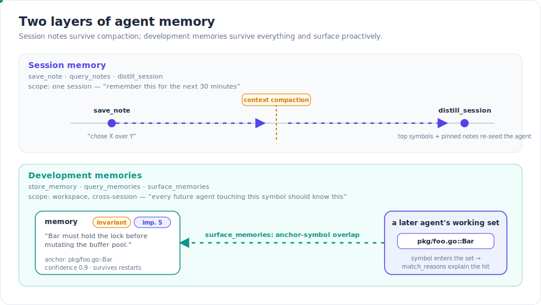
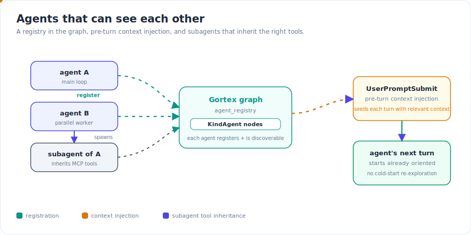
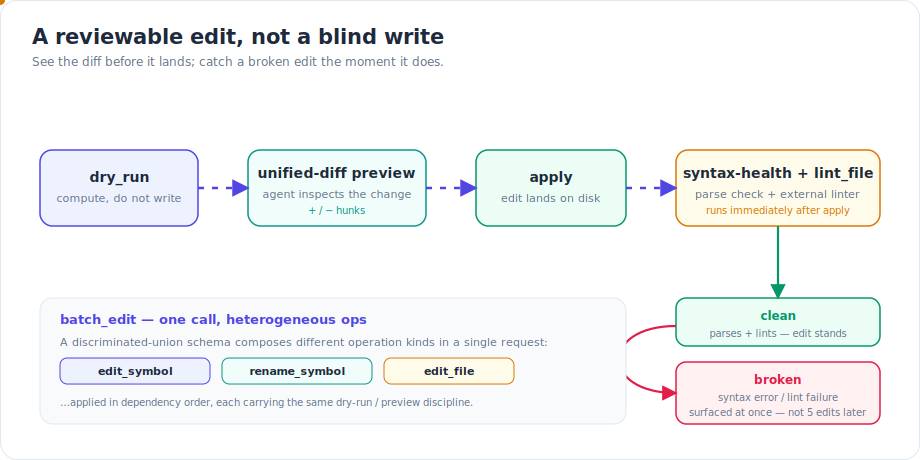

Autonomous coding agents lose almost everything they learn. A context window fills up and gets compacted; the next session starts cold; a sub-agent forks off with the wrong tools; an edit lands that doesn't even parse. Gortex already gives an agent a queryable graph of your code — this cycle's work is about turning that graph into a *teammate*: one that remembers, coordinates, and edits carefully over MCP. The throughline is that none of this is a prompt trick. Each capability is backed by graph state and a real MCP tool.

## What shipped

### Two layers of memory

The single most expensive failure mode for a long-running agent is forgetting *why* it made a call. The diff records *what* changed; the reasoning evaporates the moment the context window compacts. Gortex now has two distinct memory layers, and the distinction between them is the whole point.

*Session memory vs. development memory — two different lifetimes, two different audiences.*

**Session memory** — `save_note`, `query_notes`, `distill_session` — is a per-session scratchpad. When an agent picks an approach, rejects an alternative, or discovers a non-obvious constraint, it writes a note. Mention a symbol or file in the body and the note is auto-linked to that node in the graph. The defining property: these notes **survive a context compaction**. When the window is squeezed and the agent's working memory is gone, `distill_session` returns the top symbols, pinned notes, decisions, and recent excerpts from earlier in the same workspace — enough to re-seed the agent's mental model before it touches a single file. Think of it as "remember this for the next thirty minutes."

**Development memories** — `store_memory`, `query_memories`, `surface_memories` — are the opposite scope. They are workspace-wide and cross-session. They survive daemon restarts, agent swaps, and team rotation. Each memory carries a `kind` (`invariant`, `constraint`, `convention`, `gotcha`, `decision`, `incident`, or `reference`), an `importance` from 1 to 5, and a `confidence` from 0 to 1. The honesty of those fields matters: `invariant` means "violating this breaks the system," `gotcha` means "an agent will get this wrong without warning." This is "every future agent touching this symbol should know this."

The two are complementary, not redundant. A session note is for future-you in this session; a development memory is for every future agent in this workspace. The longer a team uses Gortex, the more the second layer compounds.

### Memories that surface themselves

The mechanism that makes development memories more than a passive store is `surface_memories`. It isn't a lookup you remember to perform — it's *proactive*. When an agent assembles its working set for a task (the symbols and files it's about to touch), `surface_memories` ranks the memory store against that set and returns the relevant ones. Ranking blends anchor-symbol overlap, file overlap, task-keyword hits, importance, pinning, recency, and confidence. Each returned memory carries `match_reasons` — `["symbol:pkg/foo.go::Bar"]` is direct evidence that *this* memory applies to *your* working set, not a vague semantic guess.

In the diagram above, a later agent pulls `pkg/foo.go::Bar` into its working set; the anchor overlap lights up the stored invariant ("Bar must hold the lock") and the memory surfaces before the agent edits anything. When a memory stops being true, `store_memory` supersedes it: the old entry stays in the store for audit but is hidden from future surfacing. History is never deleted — only superseded.

### Agents that can see each other

A single agent is the easy case. Real workflows fan out: a planner spawns workers, an editor runs a sub-agent, two agents touch the same package. For that to be safe they have to be able to coordinate.

*The coordination registry: agents as first-class graph nodes, plus pre-turn context injection.*

Coordination is built on three pieces. First, an `agent_registry` MCP tool backed by `KindAgent` nodes in the graph — agents are first-class, registrable, discoverable graph citizens rather than anonymous connections. Second, **UserPromptSubmit pre-turn context injection**: before a turn runs, the relevant context is seeded into it, so the agent starts already oriented instead of cold-starting its exploration every turn. Third, **sub-agent MCP-tool propagation** — when an agent spawns a sub-agent, the sub-agent inherits the right tools. This is documented and tested, not incidental: a sub-agent shouldn't silently lose access to the graph tools its parent relied on.

### Edits you can actually review

An agent that edits code over MCP is only as trustworthy as its edit path. A blind `Write` that overwrites a file is a liability. This cycle hardened the edit surface around a single principle: *see the change before it lands, and catch a bad one the instant it does.*

*The edit pipeline: preview before apply, verify right after.*

`edit_symbol` gained a `dry_run` mode, and the edit tools now return **unified-diff previews** — the same `+`/`−` hunk format a human reviewer reads — so the agent (or the human watching it) can inspect exactly what will change before committing to it. `batch_edit` got a **discriminated-union schema**, which lets heterogeneous operations compose in one atomic call: an `edit_symbol`, a `rename_symbol`, and an `edit_file` op can ride together, applied in dependency order. And after an edit lands, a **post-edit syntax-health check** runs, with an external-linter bridge via `lint_file`. A bad edit — one that breaks the parse or fails the linter — is surfaced immediately, at the edit that caused it, instead of five edits and three tool calls later when the failure mode is unrecognizable.

### Smaller niceties that remove friction

Two ergonomic fixes that matter in practice. The search tools now accept `pattern` as an alias for `query`, so an agent that reaches for the "wrong" parameter name still gets an answer instead of a schema error. And an **orphan watchdog** closes the MCP proxy when its parent process dies — no more zombie proxies lingering after the agent that spawned them is gone.

## How it works: anchor-symbol surfacing

It's worth being precise about why `surface_memories` is different from "ask the LLM if it remembers anything relevant." The graph already knows the symbols and files in the agent's working set as concrete node IDs. A development memory stores its anchor symbol IDs the same way. Surfacing is therefore a *structural* match over node identity first, then a ranked blend — not a fuzzy embedding similarity that hallucinates relevance. That's what makes `match_reasons` honest: when a memory comes back tagged `symbol:pkg/foo.go::Bar`, it's because the exact anchor symbol is in your working set right now. The ranking signals only reorder a set that is already structurally relevant; they don't conjure relevance out of nothing. The result is that a high-importance invariant anchored to a function you're about to edit shows up *before* you edit it, with a reason you can verify.

## Try it

These are real MCP tool names and config keys, usable today.

**Session memory (per-session, survives compaction):**

- `save_note tags:"decision" body:"chose X over Y because Z — pkg/foo.go::Bar" pinned:true`
- `query_notes symbol_id:"pkg/foo.go::Bar"` — before editing a symbol you've touched before
- `distill_session` — first thing after a compaction or at session start in a touched repo

**Development memories (cross-session, workspace-wide):**

- `store_memory kind:"invariant" body:"Bar must hold the lock before mutating the pool" symbol_ids:"pkg/foo.go::Bar" importance:5 pinned:true`
- `surface_memories task:"<task>" symbol_ids:"<top hits from smart_context>"` — right after assembling your working set
- `store_memory id:"<new>" supersedes:"<old-id>" body:"<corrected fact>"` — when a memory is no longer true

**Coordination:**

- `agent_registry` — register and discover agents (`KindAgent` nodes)
- UserPromptSubmit injection and sub-agent tool propagation are wired into the agent configuration Gortex generates

**Safe edits:**

- `edit_symbol ... dry_run:true` — compute the diff without writing
- `batch_edit` — compose `edit_symbol` / `rename_symbol` / `edit_file` operations in one call
- `lint_file` — the external-linter bridge invoked by the post-edit health check

**Adjacent capabilities worth knowing.** Overlay sessions let an editor extension push unsaved buffers as a per-session shadow graph; this cycle they gained branching and parallel speculative sessions — fork an overlay (`overlay_fork`), explore down a branch, then keep or drop it (`overlay_drop`). And artifacts — non-code knowledge files like DB schemas, API specs, and ADRs declared in `.gortex.yaml` — are indexed as `artifact` nodes and linked to the code that implements them via reference edges, so an agent can navigate from a spec to its implementation.

## Why it matters

Each of these is small on its own. Together they change what an agent *is* in this codebase. It remembers its reasoning across a compaction, inherits hard-won invariants from agents that ran weeks ago, coordinates with its peers as graph citizens, and edits behind a preview-and-verify gate instead of a blind write. The knowledge compounds: the store gets richer, the surfacing gets sharper, and the next agent starts further ahead than the last. That's the difference between a tool an agent calls and a teammate it works with.

---

*Part of the [Gortex May–June 2026 release series](/gortex/gortex-changes-may-2026).*

[← Deeper analysis](/gortex/gortex-changes-may-2026/05-deeper-analysis) · [↑ Series overview](/gortex/gortex-changes-may-2026) · [LLM providers & graph-aware routing →](/gortex/gortex-changes-may-2026/07-llm-providers-routing)
