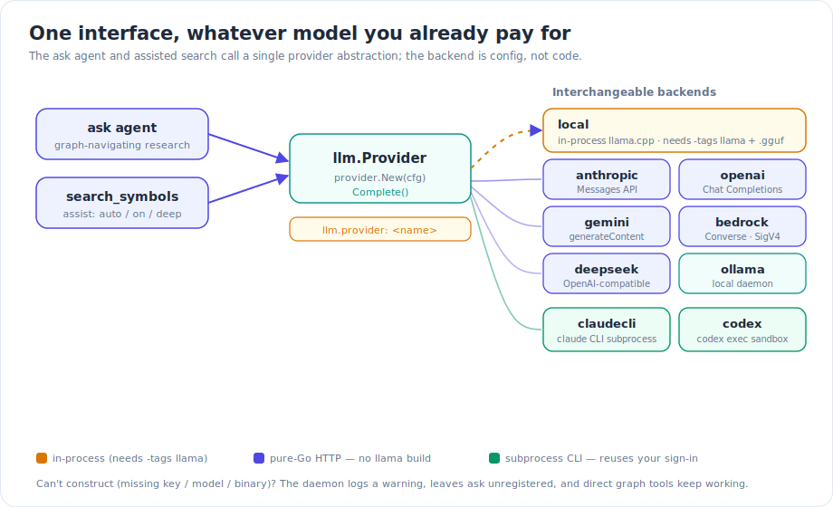
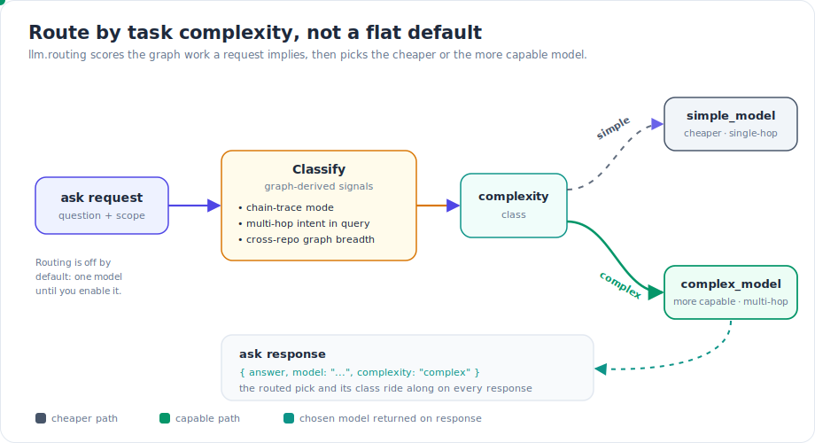
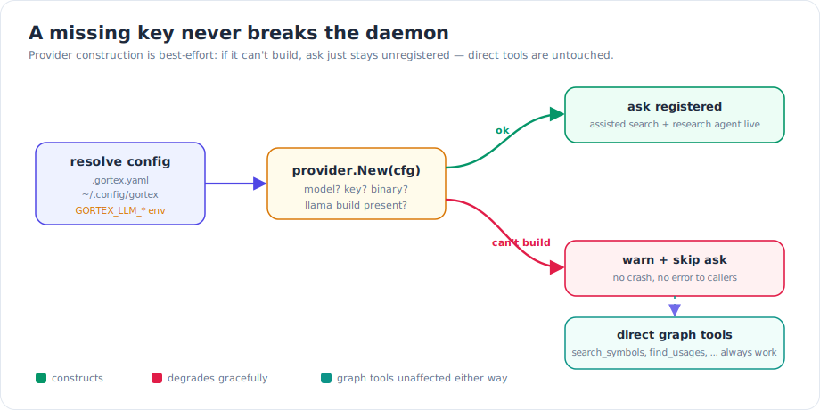

Every coding agent eventually needs a model to call: to expand a fuzzy search query, to rerank candidates, or to run a multi-hop research question across a codebase. The wrong default here is expensive in two directions — pinning everyone to a single hosted endpoint costs money and lock-in, while pinning everyone to a local model caps quality. Gortex's answer is to make the model a *configuration choice*, not a code dependency: point it at whatever you already pay for, and let the graph decide when a task is worth a more capable model.

This article covers the engine behind two features that need an LLM — the `ask` research agent and assisted search (`search_symbols` with `assist:` modes) — and the routing layer that sits in front of them.

## What shipped

### One interface, nine backends

Internally there is exactly one thing the rest of Gortex depends on: an `llm.Provider` with a `Complete()` method. A single factory, `provider.New(cfg)`, reads your configuration and returns the concrete backend you selected. Nothing above that line — the agent loop, assisted search, the MCP tool wrappers — knows or cares which model is behind it.


*One interface, whatever model you already pay for — the backend is config, not code.*

You pick a backend with `llm.provider` in `.gortex.yaml` or your user config. The released set:

- **`local`** (the default) — an in-process llama.cpp model. This is the one backend that needs a `-tags llama` build and a `.gguf` path in `llm.local.model`.
- **`anthropic`** — the Messages API. Needs `llm.anthropic.model` and `ANTHROPIC_API_KEY`.
- **`openai`** — Chat Completions. Needs `llm.openai.model` and `OPENAI_API_KEY`.
- **`ollama`** — a local Ollama daemon. Needs `llm.ollama.model` (and optionally `llm.ollama.host`).
- **`gemini`** — Google's `generateContent` REST API. Needs `llm.gemini.model` and `GEMINI_API_KEY`.
- **`bedrock`** — the AWS Bedrock Converse API, signed with SigV4. Needs `llm.bedrock.model_id` and AWS credentials (plus an optional session token); the region defaults to `us-east-1`.
- **`deepseek`** — DeepSeek's Chat Completions endpoint (OpenAI-compatible). Needs `llm.deepseek.model` and `DEEPSEEK_API_KEY`.
- **`claudecli`** — the `claude` CLI driven as a subprocess. No API key: it reuses your existing Claude Code subscription once `claude` is on `$PATH` and signed in. `llm.claudecli.model` is optional.
- **`codex`** — the OpenAI `codex` CLI as a subprocess, running `codex exec` in a read-only sandbox. It reuses your Codex / ChatGPT sign-in.

The important structural fact: **everything except `local` is pure Go.** The HTTP providers and the subprocess providers build and run *without* the `-tags llama` toolchain. So a machine that can't (or doesn't want to) compile the llama.cpp C bindings can still run the agent against Anthropic, OpenAI, Gemini, Bedrock, DeepSeek, Ollama, or one of the CLI subprocesses — no CGo required.

### Structured output, per provider

The agent and assisted search need *structured* responses (the model has to return JSON the engine can parse), and not every API exposes the same machinery for that. Rather than lowest-common-denominator everything, each provider adapts:

- **Gemini** uses `responseSchema` — but Gortex strips `additionalProperties` from the schema first, because Gemini rejects it.
- **Bedrock** forces a `respond` tool: structured output falls out of a tool call the model is required to make.
- **DeepSeek** has no strict `json_schema` mode, so it uses `response_format: json_object` plus a schema hint injected into the system prompt.

These are not user-visible knobs; they're the per-backend translation that lets one calling convention sit above nine different wire protocols.

### Graph-aware routing

A single model for every request is a blunt instrument. "Who calls `NewServer`?" and "trace how a request flows from the web tier's stats endpoint through the contract to the downstream handler and everything it touches" are not the same size of problem — but a flat default pays the same price for both.

`llm.routing` (off by default) fixes that. When you enable it, the `ask` agent is dispatched to one of two models based on how much graph work the request implies. Configure three keys: `routing.enabled`, `routing.simple_model`, and `routing.complex_model`.


*Route by task complexity, not a flat default — the cheaper or the more capable model, by graph-derived signal.*

## How it works: scoring the graph work, not the prose

The word "graph-aware" is load-bearing. The classifier doesn't just look at how long your question is — it scores the *shape of the graph traversal* the request is likely to demand. The signals are cheap to gather (no extra LLM call), and they describe how far across the graph the agent will have to reach:

- **Chain-tracing mode.** A cross-system call-chain request (consumer → contract → provider → downstream) is inherently multi-hop, so it pushes hard toward the complex class.
- **Multi-hop intent in the question.** Phrasing like *trace*, *blast radius*, *every caller*, *end-to-end*, or *refactor* signals work that spans many nodes, not a single lookup.
- **Cross-repo graph breadth.** An unscoped run over a multi-repo workspace has to reason over a wider slice of the graph than one narrowed to a single repo by a `repo` / `project` / `ref` filter.

Each signal contributes to a score; above a threshold the request is classified **complex** and goes to `complex_model`, otherwise it's **simple** and goes to `simple_model`. A trivial single-hop lookup runs on the cheaper model; a cross-system trace or a refactor-scale question earns the more capable one.

The decision isn't hidden. The chosen model and the complexity class **ride back on the `ask` response** — `model` is the routed pick, and `complexity` is `"simple"` or `"complex"` (set only when routing is enabled). You can see, per call, which model answered and why it was picked.

## How it works: a missing key never breaks the daemon

Provider construction is best-effort by design. At startup the daemon resolves your config and tries to build the selected provider. If it can't — a missing model or API key, `local` without a `-tags llama` build, `claudecli` / `codex` without the binary on `$PATH`, or `bedrock` without AWS credentials — it doesn't crash and it doesn't error out your session. It logs a warning, leaves the `ask` tool **unregistered**, and moves on.


*A missing key never breaks the daemon — ask simply stays unregistered while the graph tools are untouched.*

The payoff: the direct graph tools — `search_symbols`, `find_usages`, `get_callers`, and the rest — have no LLM dependency and keep working regardless. Misconfigured the model? You lose the research agent, not the engine.

## Try it

Pick a provider in `.gortex.yaml` (or `~/.config/gortex/config.yaml`). A hosted example, no llama build required:

```yaml
llm:
  provider: anthropic
  anthropic:
    model: <your-model>   # + ANTHROPIC_API_KEY in the environment
```

Reuse a CLI you've already signed into — no API key at all:

```yaml
llm:
  provider: claudecli     # needs `claude` on $PATH, signed in once
```

Turn on graph-aware routing:

```yaml
llm:
  provider: anthropic
  routing:
    enabled: true
    simple_model: <cheaper-model>
    complex_model: <more-capable-model>
```

Override without touching the file — handy for a one-off or CI — via environment variables like `GORTEX_LLM_PROVIDER` and `GORTEX_LLM_MODEL`, which target the active provider's model field.

Then use it. The `ask` MCP tool runs the research agent on whatever you configured:

```
ask  question: "trace how /v1/stats reaches the gortex handler"  chain: true
```

With routing enabled, that response carries its `model` and `complexity` fields. And assisted search is the same engine in a different shape — `search_symbols` takes an `assist:` mode of `auto` (the default — engages on natural-language queries, skips plain identifier lookups), `on` (force it), `off` (pure BM25), or `deep` (adds a body-grounded verification pass). When no provider is configured, the assist modes simply behave as `off`.

## Why it matters

Models change monthly, prices change, and the right model for a one-line lookup is rarely the right model for a cross-repo trace. By collapsing every backend behind one interface, Gortex turns "which model" into a line of YAML instead of a build decision — and by scoring the graph work a request implies, routing spends a capable model only where the traversal earns it. You point the engine at the model you already pay for; the graph decides when it's worth more.

---

*Part of the [Gortex May–June 2026 release series](/gortex/gortex-changes-may-2026).*

[← A much better teammate for coding agents](/gortex/gortex-changes-may-2026/06-agent-teammate) · [↑ Series overview](/gortex/gortex-changes-may-2026) · [A rebuilt storage & performance layer →](/gortex/gortex-changes-may-2026/08-storage-and-performance)
