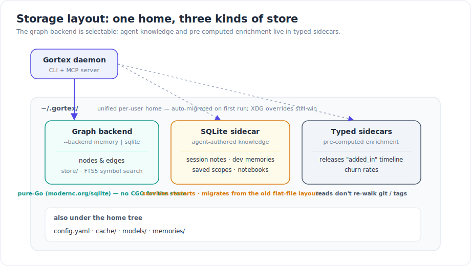
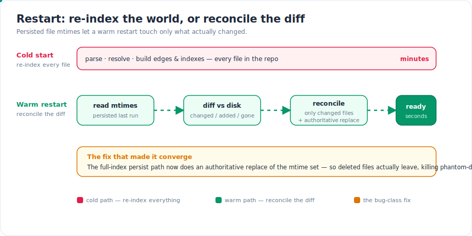
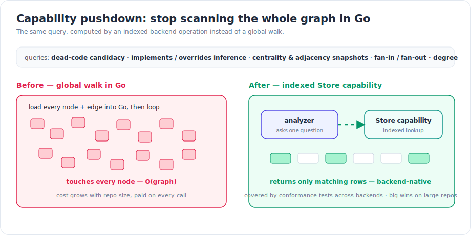

Most of what makes a code-intelligence engine feel good is invisible: it starts fast, it doesn't fall over when the repo is large, and the answers it gives don't cost more than they're worth. This month we spent serious time on that invisible layer — how Gortex persists the graph, how it comes back after a restart, and how it computes the expensive whole-graph questions. None of it is a flashy feature, but it changes how the daemon behaves on a real codebase.

## What shipped

### A pure-Go default backend

The graph store is now backed by [`modernc.org/sqlite`](https://pkg.go.dev/modernc.org/sqlite), a pure-Go SQLite implementation, and it's the **default**. That matters for a specific reason: the persistence layer no longer needs CGO. The tree-sitter parsers still link C grammars at build time, so a full Gortex build is still CGO — but the *store* is pure Go, which makes it portable and predictable to deploy.

Symbol search inside the SQLite backend is backed by FTS5, so the lexical half of search runs inside the database rather than over an in-memory scan. You pick the store explicitly:

```bash
gortex daemon start --backend sqlite    # the default
gortex daemon start --backend memory    # ephemeral, in-process
```


*One `~/.gortex` home: a selectable graph backend alongside the agent-knowledge sidecar and the pre-computed churn / releases sidecars.*

### A SQLite sidecar for agent knowledge

The graph remembers your code. A separate **SQLite sidecar** remembers what your agents learned about it. Session notes (`save_note`), cross-session development memories (`store_memory`), saved scopes (`save_scope`), and repo notebooks all persist in this sidecar, so agent-authored knowledge survives a daemon restart cleanly instead of evaporating with the process. If you used an earlier Gortex, the old flat-file layout is migrated into the sidecar on first run — you don't lose anything.

This is the difference between a teammate who keeps a notebook and one who forgets the project every morning. The graph is re-derivable from source; the *why* behind a decision is not.

### Typed sidecars for churn and releases

Two enrichment datasets that used to ride along inside per-node metadata blobs moved into their own typed stores. The release **"added_in"** enrichment — which release first introduced a symbol — is now a typed sidecar, and the churn data and releases timeline are **pre-computed**. The payoff is at read time: `get_churn_rate` and `analyze[releases]` stop walking git history and tags on every call. The expensive part happens once, during enrichment; the read is a lookup.

If you want to (re)populate that enrichment yourself, it's a CLI step:

```bash
gortex enrich churn       # pre-compute churn rates
gortex enrich releases    # build the releases / added_in timeline
gortex enrich all         # churn, blame, releases, and co-change in one pass
```

### Warm-restart reconcile

This is the change you'll feel most. A cold start re-indexes every file — parse, resolve, rebuild edges and indexes — and on a large repo that's *minutes*. A warm restart shouldn't have to do that, because almost nothing changed while the daemon was down.

So the daemon persists each file's modification time. On restart it reads the persisted mtimes, diffs them against what's on disk, and reconciles **only** the files that actually changed. The result comes back in seconds rather than re-indexing the world.


*Cold start re-indexes everything; a warm restart reads persisted mtimes, diffs them against disk, and reconciles only the difference — coming back in seconds.*

There's a subtlety that took real work to get right, called out in amber in the diagram. An earlier version of the mtime store was effectively append-only: a file that was *deleted* between runs never had its old mtime removed, so the deletion check tripped on every restart and the reconcile never converged — it kept doing whole-repo work it thought was necessary. The fix is that the full-index persist path now does an **authoritative replace** of the mtime set, so deletions actually take effect. That closed a class of phantom-deletion and never-converging-reconcile bugs in one move.

### Indexed graph capabilities

The biggest performance lever was structural. A number of analyses are fundamentally *global* — they ask a question of the whole graph: which symbols are dead-code candidates, which methods implement or override an interface, what the centrality and adjacency picture looks like, what the fan-in / fan-out and degree distribution are. Historically each of those loaded the graph into Go and looped over it.

This month a large batch of those questions became typed **Store capabilities** — backend-native operations that use the store's indexes instead of a full scan, with conformance tests so each backend gives the same answer.


*The same analysis, pushed from an O(graph) Go loop into an indexed, backend-native Store capability.*

The shape of the win is the important part. A global walk's cost grows with repo size and you pay it on *every* call. An indexed capability touches the rows it needs and lets the backend do the work it's good at. On a small project the difference is noise; on a large monorepo it's the difference between an analysis that's instant and one you wait on.

### Unified `~/.gortex` home

All per-user state now lives under a single `~/.gortex` tree: `config.yaml`, `store/`, `cache/`, `models/`, and `memories/`. Previously this was scattered across a few locations; now it's one directory you can back up, inspect, or blow away as a unit. Existing state is migrated automatically on first run, and if you set the standard XDG environment variables, those still win — the unified home is the default, not a cage.

### Per-repository incremental clone detection

Clone detection — finding near-duplicate code — is naturally O(repo): compare each fragment against everything else. Doing that on every edit would make editing painful. Instead Gortex maintains an LSH index (a count-min sketch plus a stratified index) that's updated incrementally, so re-checking after an edit is **O(edited file)**, not O(repo). Clone detection is scoped per repository — Gortex doesn't report cross-repository clones — which keeps the index bounded and the results meaningful.

## How it works: keeping the WAL from eating your disk

One operational fix is worth spelling out, because it's the kind of thing that's invisible until it isn't. SQLite in WAL (write-ahead log) mode appends changes to a `-wal` file and periodically *checkpoints* them back into the main database. Under a long-running daemon with a steady write stream and readers holding the WAL open, the default passive checkpoint can keep reusing the WAL in place rather than shrinking it — and the `-wal` file grows without bound. We saw it reach many gigabytes while the database itself stayed modest.

The fix has two parts:

1. A `journal_size_limit` pragma on the connection DSN, which caps how much WAL space SQLite holds onto.
2. A periodic checkpoint loop that runs `PRAGMA wal_checkpoint(TRUNCATE)` — a *truncating* checkpoint that flushes the log into the main file and shrinks the `-wal` back down — on a timer, with a final checkpoint on close.

It's best-effort by design: if a reader or writer is holding the WAL when the timer fires, the truncate does what it can and retries on the next tick. The net effect is a `-wal` that breathes instead of balloons.

## Try it

The store and these capabilities are driven by ordinary CLI flags, config keys, and MCP tools:

- **Pick the backend:** `gortex daemon start --backend sqlite` (default) or `--backend memory`.
- **Pre-compute enrichment:** `gortex enrich churn`, `gortex enrich releases`, or `gortex enrich all`. Then `get_churn_rate` and `analyze kind=releases` read from the typed sidecars instead of walking git.
- **Agent knowledge that persists:** `save_note` / `query_notes` and `store_memory` / `query_memories` / `surface_memories` write to the sidecar — restart the daemon and they're still there.
- **Warm restart:** just `gortex daemon restart`. The first start after an index is cold; subsequent restarts reconcile from persisted mtimes and come back in seconds.
- **Home directory:** everything's under `~/.gortex/` — `config.yaml`, `store/`, `cache/`, `models/`, `memories/`. Set `XDG_*` to relocate it; otherwise the unified home is used.

## Why it matters

These were measured, not just felt. After the FTS5-backed sidecar work, on the VS Code repository, we saw search p95 down about **77%**, impact p95 down about **83%**, `smart_context` p95 down about **55%**, and `get_file_summary` p95 down about **94%**. Those are the operations agents lean on hardest, so the savings compound across a session.

A storage layer is judged by what it lets you stop thinking about. A pure-Go default store you can deploy anywhere, a restart that costs seconds instead of minutes, enrichment reads that don't re-walk git, and global analyses that run on indexes instead of scans — together they make Gortex something you leave running and stop noticing, which is exactly the point.

---

*Part of the [Gortex May–June 2026 release series](/gortex/gortex-changes-may-2026).*

[← LLM providers & graph-aware routing](/gortex/gortex-changes-may-2026/07-llm-providers-routing) · [↑ Series overview](/gortex/gortex-changes-may-2026) · [Multi-workspace & git worktrees →](/gortex/gortex-changes-may-2026/09-multi-workspace-worktrees)
