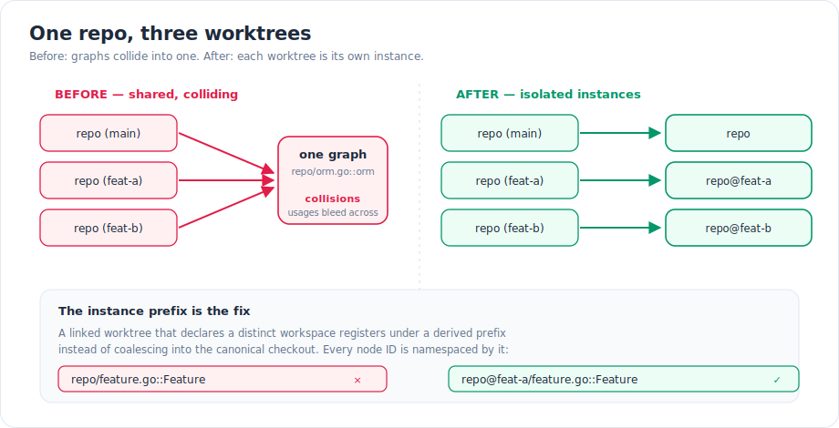
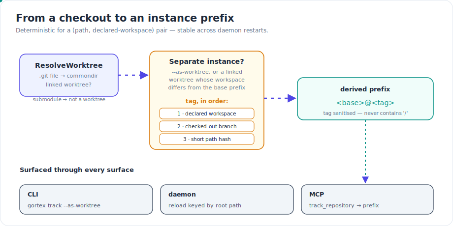
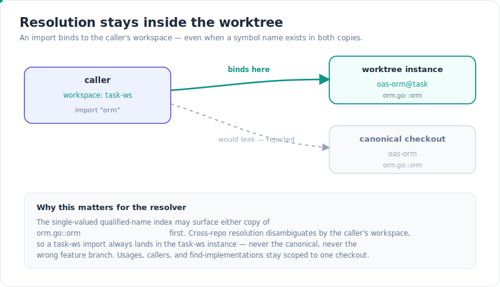

If you run more than one checkout of the same repository — one worktree per feature branch is a common pattern, and coding agents do it almost reflexively — you've probably hit a quiet failure mode in code-intelligence tooling: the second checkout's graph collides with the first. Same file paths, same symbol names, one shared index. This release fixes that at the root: Gortex now tracks each git worktree as an independent repository instance with its own graph, so usages, callers, and resolution stay correctly isolated per checkout.

## What shipped

### Each worktree is its own graph instance

A linked git worktree shares its object store with the main checkout but has a distinct working tree and (usually) a distinct branch. Historically Gortex keyed a repository by a single prefix derived from its directory basename, so two worktrees named `oas-orm` would both want the prefix `oas-orm` — and the second one silently coalesced into the first. Their files overwrote each other in the graph, and a `find_usages` on a symbol in one checkout returned matches from both.

Now a worktree that means to be its own thing gets a **derived instance prefix** of the form `<base>@<tag>`, and every node ID it produces is namespaced under that prefix. `oas-orm/orm.go::orm` and `oas-orm@task/orm.go::orm` are two different nodes in two different subgraphs. No collisions, no bleed.

*Before: graphs collide into one shared index. After: each worktree is its own instance, namespaced by a derived prefix.*

The decision to split is deliberate, not automatic for everything. A worktree becomes a separate instance when either you pass the explicit `--as-worktree` directive, **or** it's a linked worktree whose `.gortex.yaml` declares a workspace different from its base prefix. The second case is the everyday one: a declared workspace is the signal that this checkout means to live somewhere other than the canonical's, so Gortex honours it without you asking twice. A plain worktree that declares nothing distinct still coalesces, exactly as before — the new behaviour only kicks in when there's a real reason to separate.

### Surfaced through CLI, daemon, and MCP

Instancing isn't an internal bookkeeping detail you can't see or target. The derived prefix shows up everywhere you'd track or address a repo:

- **CLI** — `gortex track` resolves the same instance rule the daemon does, including the `--as-worktree` flag for a forced split.
- **Daemon** — tracked instances appear in metadata under their derived prefix, and config reload preserves them (more on the mechanics below).
- **MCP** — `track_repository` on a worktree path returns the derived prefix in its response, so an agent knows exactly which instance it just registered and can target it in later calls.

*From a checkout to an instance prefix — derived deterministically, then exposed through the CLI, daemon, and MCP.*

## How it works: deriving a stable prefix

The split happens in two steps. First, `ResolveWorktree` figures out whether a path even *is* a linked worktree. A linked worktree carries a `.git` **file** (`gitdir: <path>`) rather than a directory; the referenced per-worktree gitdir holds a `commondir` file pointing back at the shared `.git`. A git submodule also uses a `.git` file but has no `commondir`, so it correctly resolves to itself — a submodule is a separate repository, not a worktree. A main checkout (a `.git` directory) and a non-git directory both resolve to themselves too.

Second, when a separate instance is warranted, the prefix tag is chosen in a fixed priority order:

1. the **declared workspace** from the worktree's `.gortex.yaml`, if it differs from the base prefix;
2. otherwise the **checked-out branch** name (detached HEAD has none, so it's skipped);
3. otherwise a short, stable **hash of the path** — the last-resort disambiguator so two checkouts that share everything else still get distinct prefixes.

The tag is then sanitised: a repo prefix is the leading `<prefix>/` segment of every node ID, so the token must never contain a `/`. Any character outside `[A-Za-z0-9._-]` is folded to `-`. The whole derivation is a pure function of `(path, declared-workspace)`, which means it's **deterministic across daemon restarts** — a fresh index over the same config reproduces the same instance prefixes, with no dependence on a persisted name or on the order in which repos were tracked.

A nice side effect of overlapping prefixes (`oas-orm` and `oas-orm@task-ws`) is that path resolution disambiguates them by longest match: a prefixed graph path maps back to exactly one checkout on disk, never the wrong one.

## How it works: three correctness fixes that keep instances honest

Splitting the graph is only half the job. Three supporting fixes make sure the split holds up across the daemon's lifecycle.

**Warm-restart reconcile is keyed by the instance.** Gortex comes back from a restart by diffing persisted file mtimes against disk and reconciling only what changed. Because a worktree instance is its own tracked entity — with its own root path, its own branch, its own `IsWorktree` flag in metadata — that reconcile runs per instance. A worktree's branch-only files reconcile against the worktree, not against the canonical that happens to share a basename.

**The daemon matches reload diffs by root path, not by recomputed prefix.** When you edit the config file directly and the daemon reloads, it has to decide which tracked instances are still wanted and which to untrack. The trap: a worktree registered as `oas-orm@task-ws`, but `config.ResolvePrefix` on its entry would recompute the bare basename `oas-orm`. Keyed on the recomputed prefix, the reload would fail to recognise the instance as wanted and untrack it on *every* reload. So the diff is keyed on the **absolute root path** instead — the stable identity of a checkout — and a no-op reload leaves both the canonical and the worktree instance untouched.

**Imports bind to the caller's worktree workspace.** This is the resolution fix, and it prevents the subtlest leak. When two checkouts both define `orm.go::orm`, the single-valued qualified-name index can surface either copy first. Cross-repo resolution disambiguates by the *caller's* workspace: an import from a `task-ws` caller binds to the `oas-orm@task` instance, and a base-workspace caller binds to the canonical — regardless of which copy the name index happened to return. Resolution never leaks across worktrees.

*The qualified-name index may surface either copy first; cross-repo resolution binds the import to the caller's workspace.*

## Try it

The whole feature is driven by ordinary paths, config keys, CLI flags, and MCP tools — there's no new subsystem to learn.

- **Declare a workspace on the worktree.** Drop a `.gortex.yaml` in the worktree's root with `workspace: <name>`. If that name differs from the base prefix, the linked worktree is tracked as an independent instance automatically.
- **Force a split explicitly.** `gortex track --as-worktree <path>` registers a worktree as its own instance even when it declares no distinct workspace — the tag falls back to the branch, then a path hash.
- **From an agent.** Call the MCP `track_repository` tool with the worktree's path. The response carries the derived `<base>@<tag>` prefix; use it to scope later calls (`search_symbols`, `find_usages`) to that one checkout.
- **Restart freely.** `gortex daemon restart` reconciles each instance from its own persisted mtimes, and a plain config reload preserves your worktree instances because it matches by root path.

Each instance behaves like any other tracked repo: its prefix scopes search, its metadata records `IsWorktree` and the real root path, and a session launched from inside the worktree resolves to that worktree's workspace rather than the canonical's.

## Why it matters

Multiple worktrees of one repo is how a lot of real work gets done — and how coding agents parallelise across feature branches without stepping on a shared tree. The moment your tooling can't tell those checkouts apart, its answers stop being trustworthy: a usage search returns matches from the wrong branch, an impact analysis double-counts, an agent edits against a graph that's a blend of two working trees. Per-worktree instancing removes that ambiguity at the source. Keep ten worktrees of the same repository if you like; their graphs, their usages, and their resolution stay correctly, deterministically isolated.

---

*Part of the [Gortex May–June 2026 release series](/gortex/gortex-changes-may-2026).*

[← A rebuilt storage & performance layer](/gortex/gortex-changes-may-2026/08-storage-and-performance) · [↑ Series overview](/gortex/gortex-changes-may-2026)
